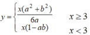
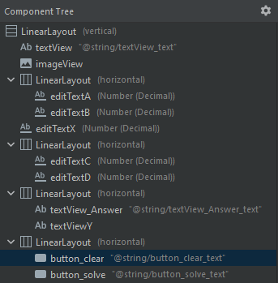
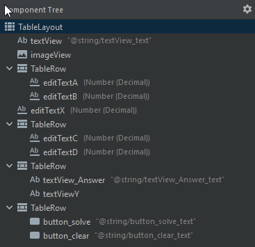

# EAK01_Calculator
## Разработка программ для мобильных устройств

 Лабораторная работа №2
 Вариант - 4

 Дерево компонентов для вертикальной разметки 

 Дерево компонентов для горизонтальной разметки 

